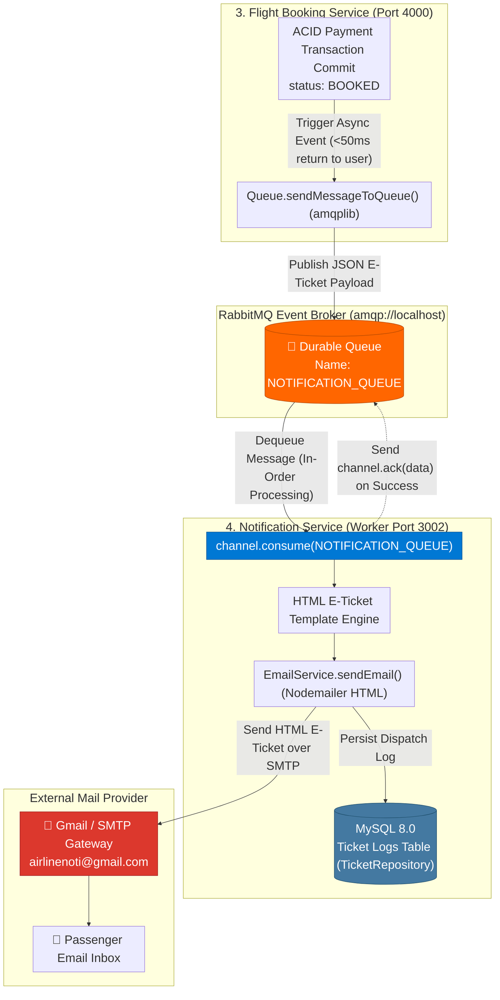

<p align="center">
  <strong>◈ SkyElite Notification Worker</strong><br/>
  <em>Asynchronous RabbitMQ Event Consumer & Nodemailer HTML E-Ticket Dispatcher</em>
</p>

<p align="center">
  
  
  
  
  
  
  
  
</p>

---

SkyElite Notification Worker (`Notification-Service-Flights`) is a **production-grade asynchronous consumer worker and SMTP dispatch service** designed to completely decouple high-latency third-party email deliveries from transactional passenger checkouts across the **SkyElite Microservices Ecosystem**.

Unlike monolithic booking systems where `nodemailer.sendMail()` runs inline inside the checkout API—causing browsers to freeze for **2 to 5 seconds** while waiting for external mail servers—SkyElite Notification Worker operates autonomously. It maintains a persistent **AMQP 0-9-1 connection (`amqplib`)** to a durable **RabbitMQ (`NOTIFICATION_QUEUE`)** message broker. 

The moment a passenger completes payment inside `Booking_Service`, an asynchronous JSON payload is enqueued and the checkout completes in **sub-50ms**. In the background, this worker dequeues the payload (`channel.consume()`), formats a responsive **HTML E-Ticket**, dispatches it securely via Gmail SMTP OAuth/App Passwords, and sends an explicit message acknowledgment (`channel.ack()`) to guarantee zero dropped notifications even during severe network spikes or external SMTP downtime.

---

## Table of Contents

- [System Architecture](#system-architecture)
- [End-to-End Pipeline](#end-to-end-pipeline)
- [What Makes This Different](#what-makes-this-different)
- [Project Structure](#project-structure)
- [Setup & Installation](#setup--installation)
- [Testing & Quality](#testing--quality)
- [API Serving & Queue Consumption](#api-serving--queue-consumption)
- [Technical Decisions](#technical-decisions)
- [Scope & Limitations](#scope--limitations)
- [Recommended Engineering Articles](#recommended-engineering-articles)

---

## System Architecture



## End-to-End Pipeline

The asynchronous notification workflow guarantees **at-least-once delivery** with manual AMQP acknowledgment:

```mermaid
flowchart LR
    A["1. Dequeue<br/>`channel.consume`"] --> B["2. Parse JSON<br/>`JSON.parse(data.content)`"]
    B --> C["3. Build HTML<br/>E-Ticket Template"]
    C --> D["4. SMTP Dispatch<br/>`nodemailer.sendMail`"]
    D --> E["5. Log Ticket<br/>MySQL `TicketRepository`"]
    E --> F["6. Acknowledge<br/>`channel.ack(data)`"]

    style A fill:#FF6600,stroke:#B34700,color:#fff
    style B fill:#1e1b4b,stroke:#6366f1,color:#fff
    style C fill:#312e81,stroke:#818cf8,color:#fff
    style D fill:#0078D4,stroke:#004e8c,color:#fff
    style E fill:#059669,stroke:#34d399,color:#fff
    style F fill:#4338ca,stroke:#c7d2fe,color:#fff
```



| Workflow | Initiator | Execution | Result |
|---|---|---|---|
| **Queue Connection Startup** | `src/index.js` on boot | `amqplib.connect(EXCHANGE_NAME)` + `channel.assertQueue` | Persistent channel ready to receive E-Ticket events |
| **Message Dequeue & Parse** | RabbitMQ broker push | `channel.consume(RABBITMQ_QUEUE_NAME, async (data))` | Extracts `recepientEmail`, `subject`, `text`, and `html` |
| **HTML E-Ticket Delivery** | `EmailService.sendEmail` | Nodemailer SMTP transport over TLS | Beautifully styled flight confirmation delivered to user |
| **Manual AMQP Acknowledgment** | Successful SMTP promise | `channel.ack(data)` explicitly removes message from RabbitMQ | Guarantees message is never lost if worker crashes mid-email |

---

## What Makes This Different

| Concern | Typical Monolith / Inline SMTP | SkyElite Notification Worker |
|---|---|---|
| **Checkout Latency Impact** | `await sendMail()` inside `makePayment` delays the HTTP response by 2-5 seconds, causing user impatience and double-clicks | **Zero latency (<50ms response):** `makePayment` pushes to RabbitMQ instantly; email generation happens asynchronously in a background process |
| **SMTP Downtime Resilience** | If Gmail SMTP is down or rate-limited, checkout API throws a `500 Internal Error` and rolls back the user's payment | **100% fault-tolerant:** If SMTP fails, the worker does *not* acknowledge (`channel.ack(data)`); RabbitMQ retains the message on disk until recovery |
| **Traffic Spike Buffering** | 10,000 flash sale bookings initiate 10,000 simultaneous SMTP connections, crashing mail servers or triggering spam blacklists | **Controlled Consumer Throttling (`channel.prefetch`):** Dequeues messages at a steady, sustainable rate without overwhelming third-party servers |
| **Audit Log Persistence** | Email delivery success or failure disappears into ephemeral terminal logs | **Sequelize Audit Logging (`TicketRepository`):** Every ticket dispatch is persisted to a MySQL table (`tickets`) for customer support auditing |

---

## Project Structure

```
Notification-Service-Flights/
├── src/
│   ├── index.js                   # Express initialization, RabbitMQ amqplib connect & consume loop
│   ├── config/
│   │   ├── server-config.js       # PORT (3002), EMAIL_ID, EMAIL_PASS, EXCHANGE_NAME, RABBITMQ_QUEUE_NAME
│   │   └── email-config.js        # Nodemailer SMTP transport configuration (`service: 'Gmail'`)
│   ├── controllers/
│   │   └── ticket-controller.js   # REST endpoint for manual ticket creation (`POST /api/v1/tickets`)
│   ├── models/
│   │   ├── index.js               # Sequelize database connection factory
│   │   └── ticket.js              # Ticket audit model (subject, content, recepientEmail, status)
│   ├── repositories/
│   │   └── ticket-repository.js   # CRUD abstractions over Ticket model (`create`, `getAll`, `update`)
│   ├── services/
│   │   └── email-service.js       # Nodemailer dispatch (`sendEmail`), pending ticket background job
│   ├── routes/
│   │   ├── index.js               # Router root (`/api`)
│   │   └── v1/
│   │       └── index.js           # API v1 routes (`/tickets`)
│   └── utils/
│       ├── errors/                # AppError custom exception handling
│       └── job.js                 # node-cron scheduled worker for retrying PENDING/FAILED tickets
├── migrations/                    # Sequelize migrations for tickets table
├── package.json                   # Dependencies: express, amqplib, nodemailer, sequelize, mysql2, node-cron
└── README.md                      # Complete architectural documentation
```

---

## Setup & Installation

### Prerequisites
- **Node.js 20+**
- **MySQL 8.0+** running on `127.0.0.1:3306`
- **RabbitMQ Broker** (`amqp://localhost`)

### Step-by-Step

```powershell
# 1. Clone the repository
git clone https://github.com/Akshansh0519/Airline-Notification-Service.git
cd Airline-Notification-Service

# 2. Configure Environment (.env)
echo PORT=3002 > .env
echo EMAIL_ID=your_gmail_id@gmail.com >> .env
echo EMAIL_PASS=your_16_char_gmail_app_password >> .env
echo EXCHANGE_NAME=amqp://localhost >> .env
echo RABBITMQ_QUEUE_NAME=NOTIFICATION_QUEUE >> .env

# 3. Install dependencies and run migrations
npm install
npx sequelize db:create
npx sequelize db:migrate

# 4. Start the Notification Worker (Terminal 4)
npm start
```

---

## How to RUN the Complete Microservice Ecosystem

Ensure MySQL and RabbitMQ (`amqp://localhost`) are running locally before starting the services. All 4 microservices work together and are reverse-proxied by the central **API Gateway Service** (Port `5000`) with JWT Authentication and Rate Limiting (`express-rate-limit`).

```bash
# Terminal 1 — API Gateway Service (Port 5000) [Central Entry Point & JWT Auth]
cd "D:\TO DO THINGS\Developer\Api_gateway_flights"
npm start

# Terminal 2 — Flight Search & Inventory Service (Port 3000)
cd "D:\TO DO THINGS\Developer\Flights_Booking_Service"
npm start

# Terminal 3 — Flight Booking Service (Port 4000) [ACID Transactions & Axios Sync]
cd "D:\TO DO THINGS\Developer\Booking_Service"
npm start

# Terminal 4 — Notification Service [RabbitMQ Async Worker & Nodemailer]
cd "D:\TO DO THINGS\Developer\Notification-Service-Flights"
npm start

# Terminal 5 — Next.js Frontend Web Application (Proxied directly via Port 5000)
cd "D:\TO DO THINGS\Developer\Flights_Booking_Service\frontend"
npm run dev
```

### 🔗 Architectural Verification & Wiring
- **All Frontend API Requests (`/api/v1/*`)** are routed directly through `http://localhost:5000` (API Gateway).
- **JWT Authentication (`/api/v1/user/signup` & `/signin`)** is handled centrally by `Api_gateway_flights` (`auth-middleware.js`).
- **Sync Communication (Axios REST):** When booking seats via Gateway (`/bookingService/api/v1/bookings`), `Booking_Service` (`Port 4000`) synchronously verifies and locks seats from `Flights_Booking_Service` (`Port 3000`).
- **Async Communication (RabbitMQ):** When a payment commits, `Booking_Service` publishes a confirmation event to `RabbitMQ`, which `Notification-Service-Flights` consumes to send HTML E-Tickets via Nodemailer.
- For a deep dive into how Axios and RabbitMQ connect our microservices, read **[MICROSERVICES_COMMUNICATION_GUIDE.md](../Flights_Booking_Service/MICROSERVICES_COMMUNICATION_GUIDE.md)**.

---

## Testing & Quality

To verify RabbitMQ queue consumption and manual AMQP acknowledgment, check the consumer logic:

```powershell
# Verify consumer attaches directly to NOTIFICATION_QUEUE
grep -rn "channel.consume" src/

# Verify explicit channel acknowledgment (no autoAck data loss)
grep -rn "channel.ack" src/

# Verify Nodemailer transport is configured securely via App Passwords
grep -rn "nodemailer.createTransport" src/
```

---

## API Serving & Queue Consumption

### RabbitMQ AMQP Consumer Specification
| Broker URL | Queue Name | Acknowledgment Mode | Payload Structure |
|---|---|---|---|
| `amqp://localhost` | `NOTIFICATION_QUEUE` | **Manual (`channel.ack(data)`)** | `{ recepientEmail, subject, text, html, status: 'BOOKED' }` |

### Auxiliary REST Endpoints (`Port 3002`)
| Method | Endpoint | Body | Description |
|---|---|---|---|
| `POST` | `/api/v1/tickets` | `{ subject, content, recepientEmail }` | Manually queue or log an E-Ticket outside of the automated RabbitMQ pipeline |

---

## Technical Decisions

| Decision | Rationale |
|---|---|
| **Manual AMQP Acknowledgment (`channel.ack`)** | Setting `noAck: true` tells RabbitMQ to delete the message as soon as it is sent to the worker. If `nodemailer` fails or the Node process crashes mid-delivery, the E-Ticket is lost forever. Using explicit `channel.ack(data)` guarantees **at-least-once delivery**. |
| **RabbitMQ Durable Queues (`channel.assertQueue`)** | Asserting the queue ensures that even if `Notification-Service-Flights` is completely powered off during a flash sale, `Booking_Service` can still publish messages safely to RabbitMQ disk buffers. |
| **Cron Retry Worker (`job.js`)** | In addition to RabbitMQ consumption, `node-cron` scans the `tickets` MySQL table every 5 minutes for any emails marked `PENDING` or `FAILED`, retrying them via `EmailService.sendEmail` to provide dual-layer notification redundancy. |

---

## Scope & Limitations

> **Transparency note:** This service is engineered to demonstrate event-driven notification decoupling within a distributed architecture.

- **Single Queue Worker:** Currently runs a single `amqplib` consumer thread inside `index.js`. For handling millions of notifications, this should be scaled across Kubernetes pods with `channel.prefetch(10)` fair dispatching.
- **HTML E-Ticket Styling:** Currently uses clean table-based HTML strings (`emailHtml` generated in `Booking_Service`). Production enterprise systems integrate templating engines like Handlebars (`.hbs`) or React-Email (`@react-email/components`).
- **SMTP vs API Transports:** Currently uses Gmail SMTP (`nodemailer`). High-volume transactional deployments should swap `email-config.js` with AWS SES or SendGrid HTTP API drivers to prevent Gmail daily sending quotas (`500 emails/day`).

---

## Recommended Engineering Articles

1. ⭐⭐⭐ **Event-Driven Architectures & Decoupling**
   [Pattern: Event-Driven Architecture in Microservices (Chris Richardson)](https://microservices.io/patterns/data/event-driven-architecture.html)
2. ⭐⭐⭐ **AMQP 0-9-1 & RabbitMQ Reliability Best Practices**
   [RabbitMQ Reliability Guide: Acknowledgments, Publisher Confirms & Durability](https://www.rabbitmq.com/docs/reliability)
3. ⭐⭐⭐ **Guaranteeing At-Least-Once Delivery in Message Brokers**
   [Designing Resilient Consumer Workers with RabbitMQ and Node.js](https://www.cloudamqp.com/blog/part1-rabbitmq-for-beginners-what-is-rabbitmq.html)
4. ⭐⭐ **Transactional Emails & Node.js Transport Security**
   [Nodemailer Security Best Practices and OAuth2 Authentication](https://nodemailer.com/smtp/oauth2/)
5. ⭐⭐⭐ **Background Job Processing with Cron & Queues**
   [When to Use Message Queues vs Scheduled Cron Workers in Backend Systems](https://martinfowler.com/articles/patterns-of-distributed-systems/message-queue.html)

---

<p align="center">
  Built with intention by <strong>Akshansh Ranjan</strong>
</p>